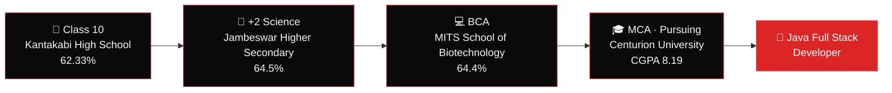

  

  

  
  &nbsp;
  
  &nbsp;
  
  &nbsp;
  

  

  

<h2 align="center">🔴 About Me</h2>

  

  

  Hey! I'm <b>Dibyajeet Mishra</b>, an <b>MCA student and aspiring Java Full Stack Developer</b> from Bhadrak, Odisha, India. 
  I work with <b>Java, Spring Boot, Angular, TypeScript and MySQL</b>, and I enjoy applying OOP, database management, REST API development and problem-solving to real software projects.

<table align="center" border="0">
<tr>
  <td align="left" style="padding: 8px 16px;">💼 <b>Role</b></td>
  <td align="left" style="padding: 8px 16px;">Java Full Stack Developer</td>
</tr>
<tr>
  <td align="left" style="padding: 8px 16px;">📍 <b>Location</b></td>
  <td align="left" style="padding: 8px 16px;">Bhadrak, Odisha, India</td>
</tr>
<tr>
  <td align="left" style="padding: 8px 16px;">⚙️ <b>Stack</b></td>
  <td align="left" style="padding: 8px 16px;">Java · Spring Boot · Angular · TypeScript · MySQL</td>
</tr>
<tr>
  <td align="left" style="padding: 8px 16px;">🧰 <b>Tools</b></td>
  <td align="left" style="padding: 8px 16px;">Git · GitHub · Maven · IntelliJ IDEA · Postman</td>
</tr>
<tr>
  <td align="left" style="padding: 8px 16px;">🎯 <b>Looking for</b></td>
  <td align="left" style="padding: 8px 16px;">Entry-level Java Full Stack role</td>
</tr>
</table>

  
  &nbsp;
  
  &nbsp;
  

<table width="100%" border="0" align="center">
<tr>
<td width="50%" align="center" style="padding: 14px;">
  <h4>🔭 Current Focus</h4>
  
<b>Java Full Stack Development</b> Spring Boot + Angular + MySQL

</td>
<td width="50%" align="center" style="padding: 14px;">
  <h4>🎓 Education</h4>
  
<b>MCA @ Centurion University</b> CGPA: 8.19 (Pursuing)

</td>
</tr>
<tr>
<td width="50%" align="center" style="padding: 14px;">
  <h4>🤖 Internship</h4>
  
<b>AI &amp; ML @ EduvateSkills</b> 45-day Summer Internship Program

</td>
<td width="50%" align="center" style="padding: 14px;">
  <h4>🤝 Collaboration</h4>
  
<b>Java, Web &amp; AI/ML</b> Open to learning and contributing

</td>
</tr>
</table>

  

<h2 align="center">🚀 Featured Projects</h2>

<i>Hands-on projects where I applied Java, Spring Boot, JDBC, Hibernate and MySQL.</i>

<table width="100%" border="0" align="center">
<tr>
<td align="center" style="padding: 22px;">
  <h3>💸 UPI Without Internet – Payment Management System</h3>
  
<i>A Spring Boot backend demonstrating payment management functionality for limited or no internet environments.</i>

  

    ✔ RESTful APIs &amp; CRUD operations 
    ✔ Hibernate ORM for database persistence 
    ✔ Maven for dependency and build management
  

  

    
    
    
     
    
    
    
  

  

    
  

</td>
</tr>
<tr>
<td align="center" style="padding: 22px;">
  <h3>🧑‍💼 Employee Management System</h3>
  
<i>A desktop-based employee management application with complete CRUD operations and persistent data storage.</i>

  

    ✔ Interactive GUI built with Swing &amp; AWT 
    ✔ MySQL integration through JDBC 
    ✔ Applied OOP, database connectivity and CRUD concepts
  

  

    
    
    
    
  

  

    
  

</td>
</tr>
</table>

  
  &nbsp;
  

  

<h2 align="center">🛠️ Tech Stack & Skills</h2>

<b>Languages</b>

  

<b>Frontend</b>

  

<b>Backend &amp; Database</b>

  

<b>Tools</b>

  

<b>Concepts</b>

  
  
  
  
  
  
  

  

<h2 align="center">🎓 Education Journey</h2>

<b>📋 View full education details</b>

 

<table align="center">
<tr>
  <th align="left">Qualification</th>
  <th align="left">Institution</th>
  <th align="left">Score</th>
</tr>
<tr>
  <td>Master of Computer Applications (MCA) <i>— Pursuing</i></td>
  <td>Centurion University</td>
  <td><b>CGPA: 8.19</b></td>
</tr>
<tr>
  <td>Bachelor of Computer Application (BCA)</td>
  <td>MITS School of Biotechnology</td>
  <td>64.4%</td>
</tr>
<tr>
  <td>Higher Secondary (+2), Science</td>
  <td>Jambeswar Higher Secondary School</td>
  <td>64.5%</td>
</tr>
<tr>
  <td>Secondary School (Class 10)</td>
  <td>Kantakabi High School</td>
  <td>62.33%</td>
</tr>
</table>

  

<h2 align="center">💼 Internship</h2>

<table width="100%" border="0" align="center">
<tr>
<td align="center" style="padding: 18px;">
  <h3>🤖 Summer Internship Program in Artificial Intelligence &amp; Machine Learning</h3>
  
<b>EduvateSkills Technologies</b> &nbsp;|&nbsp; 45 days

  

    ✔ Project-oriented technical learning with professional mentorship 
    ✔ Practical exposure to AI/ML concepts, problem-solving and project-based development
  

</td>
</tr>
</table>

  

<h2 align="center">💪 Strengths</h2>

  
  
  
  

  

<h2 align="center">📊 GitHub Analytics & Activity</h2>

  
  &nbsp;&nbsp;
  

  

  

  

  

<h2 align="center">⚡ Contribution Journey</h2>

  

  

<h2 align="center">📬 Let's Connect &amp; Collaborate</h2>

<i>Looking for an entry-level Java Full Stack role, or just want to say hello? My inbox is always open!</i>

<table border="0" align="center">
<tr>
<td align="center" width="200" style="padding: 16px;">
  <a href="https://www.linkedin.com/in/dibyajeet-mishra-2332682b9/" target="_blank">
    
      
    
  </a>
   
  <b>Professional Network</b>
</td>
<td align="center" width="200" style="padding: 16px;">
  <a href="https://github.com/mishra-1234" target="_blank">
    
      
    
  </a>
   
  <b>Code &amp; Projects</b>
</td>
<td align="center" width="200" style="padding: 16px;">
  <a href="https://www.instagram.com/dibya_x_88/" target="_blank">
    
      
    
  </a>
   
  <b>Life &amp; Updates</b>
</td>
<td align="center" width="200" style="padding: 16px;">
  <a href="mailto:dibyamishra379@gmail.com">
    
      
    
  </a>
   
  <b>Direct Contact</b>
</td>
</tr>
</table>

  

  

